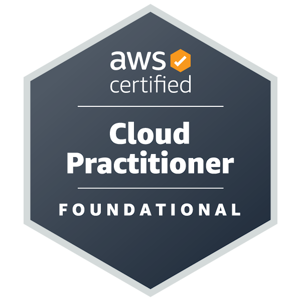

<h1 align="center">Hi 👋, I'm Purna Venkata Sekhar</h1>

<h3 align="center">
Aspiring Software Engineer • Full Stack Developer • AWS Certified Cloud Practitioner • AI, Data Science & Machine Learning Enthusiast
</h3>

Passionate about building scalable software solutions, AI-powered applications, and cloud technologies while continuously improving my problem-solving skills.

---

# 🚀 About Me

🎓 B.Tech in Computer Science & Engineering

☁️ **AWS Certified Cloud Practitioner**

💻 Full Stack Developer specializing in React & Spring Boot

🤖 Passionate about Artificial Intelligence & Machine Learning

🏆 Solved **1400+ Coding Problems** on CodeChef

🚀 Hackathon Participant & Team Leader

🌱 Currently exploring

- Generative AI
- Machine Learning
- Cloud Computing
- System Design
- Backend Development

---

# 🏅 AWS Certification

## AWS Certified Cloud Practitioner

Successfully earned the **AWS Certified Cloud Practitioner** certification, demonstrating foundational knowledge of Amazon Web Services (AWS), cloud computing concepts, security, networking, pricing, and core AWS services.

### Certification Details

- **Issued By:** Amazon Web Services (AWS)
- **Issued:** July 20, 2026
- **Valid Until:** July 20, 2029
- **Status:** Active

### Credential Verification

🔗 https://cp.certmetrics.com/amazon/en/public/verify/credential/996f52b4d83948079aba33cb0059a60d

---

# 💼 Current Focus

🔹 Building AI-powered applications

🔹 Improving Data Structures & Algorithms

🔹 Developing scalable Spring Boot applications

🔹 Designing Cloud-Native Applications on AWS

🔹 Preparing for Software Development Engineer (SDE) roles

---

# 🛠️ Tech Stack

## 👨‍💻 Programming Languages

- C
- C++
- Java
- Python
- SQL

---

## 🌐 Frontend

- HTML5
- CSS3
- JavaScript
- React.js
- Tailwind CSS

---

## ⚙️ Backend

- Spring Boot
- REST APIs
- Firebase Authentication

---

## 🗄️ Databases

- MySQL
- Amazon RDS
- Firestore

---

## ☁️ Cloud

- AWS EC2
- AWS IAM
- AWS S3
- AWS Lambda
- AWS VPC
- AWS RDS
- AWS CloudFormation
- Elastic Load Balancer (ELB)
- Auto Scaling
- Route 53
- CloudWatch

---

## 🔧 Tools & Technologies

- Git
- GitHub
- Docker
- Kubernetes
- Maven
- VS Code
- Eclipse
- Postman
- Figma

---

# 🚀 Featured Projects

## 🛵 DeliverSure – AI-Powered Insurance Platform

An intelligent insurance platform designed for gig workers and food delivery riders that predicts disruptions using AI and automates insurance claim processing.

### Technologies

- React
- Spring Boot
- AWS
- Firebase
- Machine Learning
- Weather APIs
- MySQL

### Key Features

✔ AI Risk Prediction

✔ Dynamic Premium Calculation

✔ Claims Management

✔ Weather-based Predictions

✔ Secure Authentication

---

## 🌱 EcoLearn

A gamified sustainability learning platform designed to educate users through interactive lessons, quizzes, and challenges.

### Technologies

- React
- Spring Boot
- Firebase
- MySQL

### Features

✔ Interactive Learning

✔ Carbon Footprint Tracking

✔ Quiz Modules

✔ User Dashboard

---

## 📊 Mutual Fund Investment Analysis

A data analytics project focused on understanding investor behavior and investment patterns using statistical analysis and visualization.

---

# 🏆 Achievements

🏅 AWS Certified Cloud Practitioner

🏅 Cisco Data Analytics Essentials

🏅 Cisco Introduction to Modern AI

🏆 Solved **1400+ Coding Problems** on CodeChef

🚀 Team Leader – DevTrails University Hackathon

💡 Presented innovative solutions in multiple hackathons

---

# 📚 Currently Learning

- Large Language Models (LLMs)
- Machine Learning
- Generative AI
- Spring Security
- Microservices
- Docker & Kubernetes
- AWS Solutions Architect Associate
- Advanced AWS Services

---

# 🎯 Career Objective

To build impactful software solutions that solve real-world problems using Artificial Intelligence, Cloud Computing, and Modern Software Engineering while contributing to innovative engineering teams.

---

# 📈 GitHub Goals (2026)

✅ Earn More AWS Certifications

✅ 1000+ GitHub Contributions

🎯 Build 10+ Production-Level Projects

🎯 Master System Design

🎯 Become a Software Development Engineer (SDE)

🎯 Build Scalable Cloud-Native Applications

---

# 💻 Competitive Programming

🏆 CodeChef

🏆 LeetCode

🏆 HackerRank

**Problem Solving | DSA | Algorithms | Competitive Programming**

---

# 📜 Certifications

🥇 AWS Certified Cloud Practitioner

📊 Cisco Data Analytics Essentials

🤖 Cisco Introduction to Modern AI

---

# 🤝 Let's Connect

📧 **Email:** 2400032407@kluniversity.in

💼 **LinkedIn:**  
https://www.linkedin.com/in/purna-venkata-sekhar-kalagara-099885348/

🐙 **GitHub:**  
https://github.com/KalagaraSekhar

🌐 **Portfolio:**  
Coming Soon

---

<h3 align="center">
⭐ Thanks for visiting my profile!
</h3>

<b>"Code. Learn. Build. Repeat."</b>

